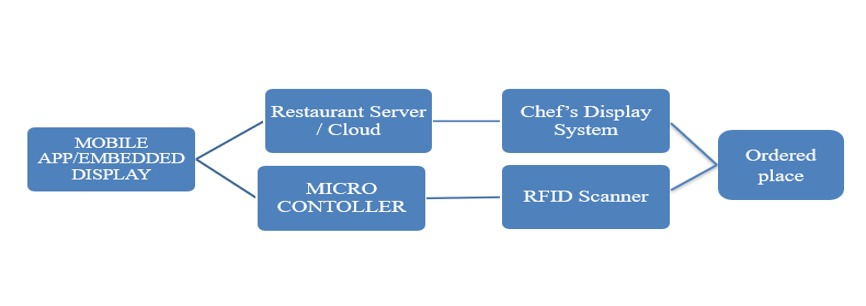
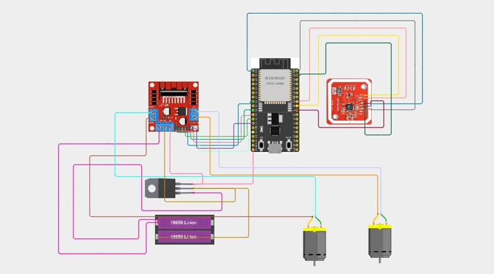
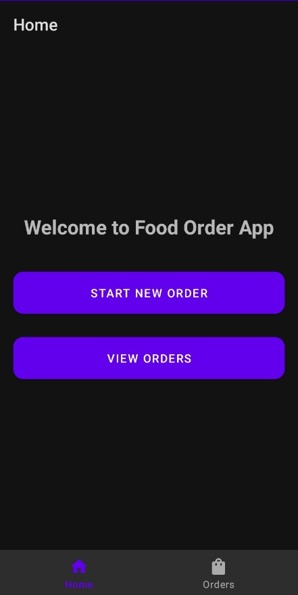
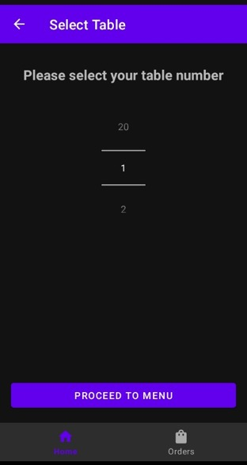
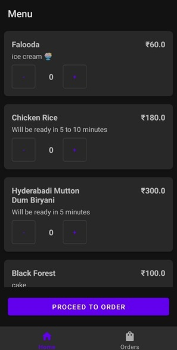
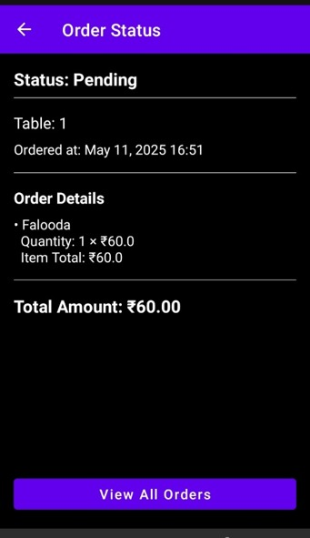
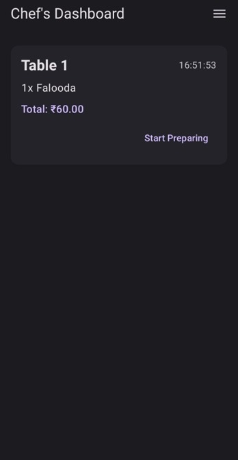
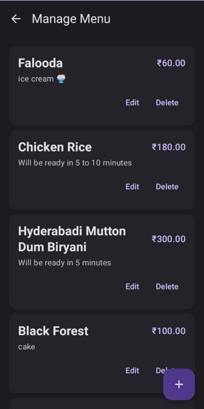

# IoT-Based Smart Restaurant Ordering System

An IoT-powered smart restaurant automation system that eliminates manual ordering,
reduces human errors, and automates food delivery using ESP32, RFID, Firebase, and
a custom Android application.

---

## Project Overview

Traditional restaurants face inefficiencies like manual order-taking, wrong food
deliveries, slow billing, and lack of real-time menu updates. This project solves
these problems by integrating IoT technology to automate the entire dining experience
from ordering to delivery.

---

## Features

- Digital E-Menu — Customers browse and order food through a mobile app
- RFID Table Authentication — Ensures food is delivered to the correct table
- Automated Food Delivery — Motor-driven tray navigates to the right table
- Chef Dashboard — Real-time order alerts and kitchen management
- Real-Time Order Tracking — Status updates: Preparing, Ready, Delivered
- Digital Payment Integration — Contactless payment via the app
- Live Menu Updates — Chef can add or remove items instantly
- Firebase Cloud Backend — Real-time data sync across all devices

---

## Hardware Components

| Component | Purpose |
|-----------|---------|
| ESP32 Microcontroller | Brain of the system, handles WiFi, RFID, motor control |
| PN532 RFID Reader | Reads RFID tags to identify tables |
| RFID Tags | Attached to trays and tables for identification |
| L298N Motor Driver | Controls the DC motors for delivery |
| DC Motors (x2) | Powers the food delivery tray |
| C7805 Voltage Regulator | Steps down battery voltage to stable 5V |
| 18650 Li-ion Battery | Power source for the system |
| Capacitive Touchscreen TFT LCD | E-Menu and order display interface |

---

## Software and Tech Stack

| Technology | Usage |
|------------|-------|
| Arduino IDE | ESP32 firmware development |
| Android Studio | Mobile app development |
| Firebase Firestore | Cloud database for orders and menu |
| Firebase Authentication | Secure user login and logout |
| Adafruit PN532 Library | RFID reader communication |
| ArduinoJson Library | JSON parsing for Firebase responses |
| HTTPClient Library | REST API calls to Firestore |

---

## System Architecture
Customer (Mobile App)
|
Selects Table and Places Order
|
Firebase Firestore (Cloud)
|
ESP32 fetches latest order
|
Motors start — Tray moves
|
RFID Scanner detects correct table tag
|
Motors pause — Food delivered
|
Chef updates status — Customer notified

---

## Flow Diagram



---

## Circuit Diagram



---

## ESP32 Pin Configuration

| Pin | Component |
|-----|-----------|
| GPIO 18 | PN532 SCK (SPI Clock) |
| GPIO 23 | PN532 MOSI |
| GPIO 19 | PN532 MISO |
| GPIO 5 | PN532 SS (Chip Select) |
| GPIO 26 | L298N IN1A (Motor A) |
| GPIO 27 | L298N IN2A (Motor A) |
| GPIO 33 | L298N ENA (Motor A Enable) |
| GPIO 14 | L298N IN1B (Motor B) |
| GPIO 12 | L298N IN2B (Motor B) |
| GPIO 13 | L298N ENB (Motor B Enable) |
| GPIO 4 | Reset Push Button |

---

## RFID Tag UIDs

| Tag | Purpose |
|-----|---------|
| 05 E0 A1 02 | STOP tag — permanently stops motors |
| 15 87 87 02 | Pause tag — Table 1 |
| B5 51 46 01 | Pause tag — Table 2 |
| B5 22 0C 01 | Pause tag — Table 3 |
| B9 2B 57 16 | Pause tag — Table 4 |
| 85 38 FF 03 | Pause tag — Table 5 |

---

## App Screenshots

### Customer App

| Home Screen | Table Selection | E-Menu | Order Status |
|-------------|----------------|--------|--------------|
|  |  |  |  |

### Chef Dashboard

| Dashboard Interface | Menu Management |
|--------------------|----------------|
|  |  |

---

## Setup Instructions

### ESP32 Firmware

1. Clone this repository
```bash
git clone https://github.com/sathees-waran/iot-smart-restaurant-ordering-system.git
```
2. Open `final_test1.ino` in Arduino IDE
3. Install required libraries:
   - Adafruit PN532
   - ArduinoJson
   - HTTPClient (built-in with ESP32)
4. Update your credentials in the code:
```cpp
#define WIFI_SSID "YOUR_WIFI_SSID"
#define WIFI_PASSWORD "YOUR_WIFI_PASSWORD"
```
5. Select ESP32 board from Tools menu
6. Flash to ESP32

### Android App

1. Open the Android app folder in Android Studio
2. Connect your Firebase project
3. Add your `google-services.json` file
4. Build and run on your Android device

---

## Future Improvements

- Voice-activated ordering via Alexa or Google Assistant
- AI-based food recommendations
- Analytics dashboard for restaurant managers
- Multi-language support
- Inventory management integration

---

## Team Members

| Name | Roll Number |
|------|-------------|
| Santhosh P | 2116220801183 |
| Satheeswaran M | 2116220801188 |
| Sivan P | 2116220801202 |

**Supervisor:** Dr. Thilakavathi B, M.E, Ph.D, Professor
**Department:** Electronics and Communication Engineering
**Institution:** Rajalakshmi Engineering College, Chennai - 602105
**University:** Anna University, Chennai - 600025
**Year:** 2025

---

## References

1. Jaiswal, A. S., et al., "Smart Food Ordering System For Restaurants," ResearchGate, 2023.
2. Qasim, M. A., et al., "AI-Based Smart Robot for Restaurant Serving Applications," Springer, 2022.
3. Abbas, Z., et al., "Automatic Cafe Management System Using Waiter Robot," IEEE Explore, 2019.
4. Liyanage, V., et al., "Foody - Smart Restaurant Management and Ordering System," IEEE Explore, 2018.
5. Rajesh, M., et al., "E-Restaurant: Online Restaurant Management System for Android," Academia, 2015.
6. Jakhete, M. D., "Implementation of Smart Restaurant with e-menu Card," Academia, 2015.

---

## License

This project was developed as part of the academic curriculum at
Rajalakshmi Engineering College under Anna University, Chennai.
